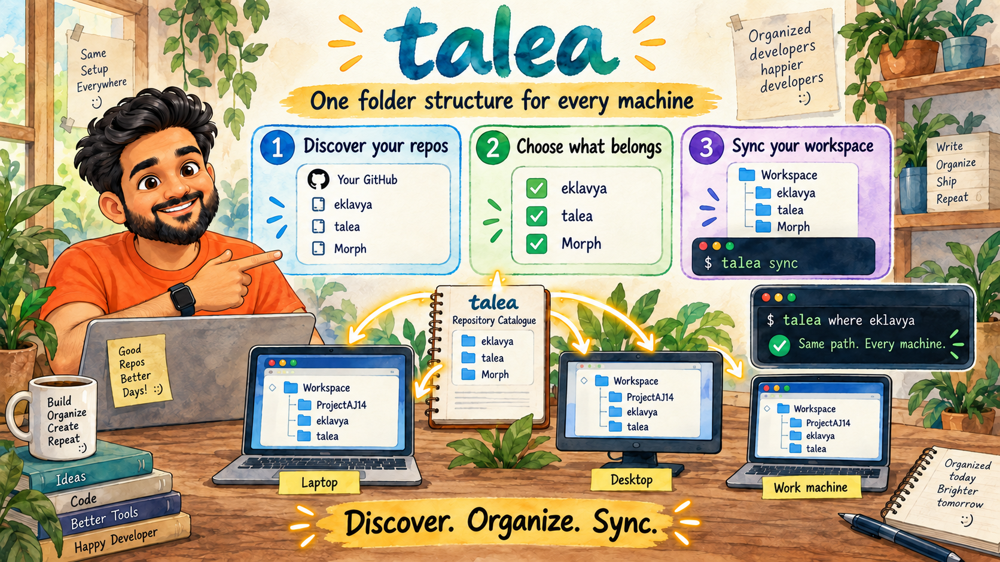

# talea

**One folder structure for every machine you work on.**

[talea-run.web.app](https://talea-run.web.app) — the site, and [the manual](https://talea-run.web.app/docs/).



You have a laptop, a desktop, and a work machine. On each one, the repo you want
is either missing or somewhere you have to go and find. `talea` fixes that: one
catalogue of your GitHub repos, one tree, and a command that makes any machine
match it.

```
~/Workspace/
  ProjectAJ14/
    eklavya/
    Morph/
    d-pilot/
  nonstopio/
    flutter_forge/
    json-viewer/
```

Same paths on every machine. `cd $(talea where eklavya)` works everywhere.

---

## Install

```sh
npm install -g @ajaykumarnpm/talea
```

The package is scoped; the command it installs is just `talea`.

Node 20 or newer. No other dependencies — not at runtime, not to build it.

## Your first machine

```sh
talea doctor                 # git, SSH and GitHub auth all reachable?
talea init ~/Workspace       # discovers your repos, asks what to keep, clones
talea manifest push          # publish the catalogue so the next machine can read it
```

`init` builds the catalogue from your GitHub account the first time — your own
repos, every org you belong to, and anything shared with you directly. It then
asks what this machine should keep and fills the tree.

Every command works from anywhere after that. Outside the workspace it uses
the one `init` made; with more than one on the machine, it asks which.

## Every machine after that

```sh
talea manifest pull <gist-id>   # the id `manifest push` printed
talea init ~/Workspace
```

You are handed the full list with your defaults already ticked. Tick the extras
this machine needs, untick what it does not, press enter.

## Every day

```sh
talea sync                   # clone the new, fast-forward the rest
talea status                 # branch, clean/dirty, ahead/behind, in one table
talea prune                  # which finished worktrees can go, and what they hold
talea add some-repo          # keep one more on this machine, and clone it now
talea select                 # reopen the checklist and change the whole list
talea pick some-repo          # keep that one — an unknown name opens the checklist
cd $(talea where eklavya)
```

## Cleaning up worktrees

Every worktree carries its own `node_modules`, `build` or `.dart_tool`, so the
ones you forgot about can hold gigabytes long after their branches merged.

```sh
talea prune                  # every linked worktree, its verdict and its size
talea prune --apply          # remove the merged and unused ones
```

A worktree is `merged` when every commit on it is on `origin/<default branch>`
— directly, or as an identical change after a rebase merge. A merge commit on
the branch counts only when it is the merge git would make by itself; one that
adds a change of its own reads as `unmerged` (checking one needs git 2.38+). `dirty`, `locked`
and `unmerged` ones are kept, and so is a `nested` one — merged, but with a repo inside its folder that
holds work of its own (a linked worktree, uncommitted changes, a stash, or a
commit no remote has), which removing it would delete. A clean clone a build
tool left there, such as SwiftPM's `checkouts/`, does not count, though its own
ignored files are judged wherever it sits — a `.env` in a clone under `build/`
keeps the worktree. Anything talea cannot read — a folder it may not open, a git
call that fails — keeps it as `unreadable`, and `--apply` judges each worktree
again just before removing it, so a file that appeared since the plan keeps it
too; `missing` ones (folder already gone) have their
record cleared. A branch with no commits yet looks merged: cut in the last day
it is `fresh` and kept, a task just started; older, it is `unused` and removed,
and the verdict shows its age. A lock is kept, unless it is one Claude Code left
on an agent worktree whose process has exited — then the verdict says `stale
lock`, and `--apply` unlocks it before removing it. The dim line under a locked
row shows the lock's reason. The removal is `git worktree
remove`, never forced, and the **branch is kept**, so `git worktree add` brings
any of them back. git deletes ignored files without asking, so a merged worktree
holding ignored files that are not build output — a `.env`, notes — is kept as
`ignored`, with the files named. Move them out, or pass `--with-ignored`. A
file identical to the main checkout's copy at the same path does not count —
it survives the removal. Nor does build output: talea ships a list —
`node_modules`, `build`, Flutter's `ephemeral/`, `*.iml` and the rest — in
[`src/regenerable.gitattributes`](src/regenerable.gitattributes), git's own
attributes syntax, so adding an ecosystem is adding a line. A repo takes one
back with `-talea-regenerable`, and a pattern for every repo on a machine goes
in git's global attributes file. Nor does a file the repo declares build output with a
`.gitattributes` line such as `web/public/runtime.html talea-regenerable` — for
a file a build copies out of tracked source, whose main-checkout copy is only as
fresh as its last build. It is read from origin's default branch too, so a mark
added today covers worktrees branched before it. Mark only what a build
really writes: a marked file is deleted with the folder. Each row shows the worktree's folder name, with its
full path dimmed on the line below.

A **squash merge** reads as `unmerged`: the squashed commit is new, and telling
it apart would mean asking GitHub. Remove those by hand.

## Let your coding agent do it

```sh
talea skill install
```

Installs a skill into Claude Code at **user scope**, so every project you open
has it. After that `"where is eklavya?"` and `"my repos are scattered, tidy them
up"` reach the right command — with the guardrails attached: an adopt is always
shown as a dry run first, `--loose` is never taken on your behalf, and a removal
is reported as *taken off the list* rather than as a delete.

`talea skill` says whether it is installed, `talea skill uninstall` takes it back
out, and it refuses to overwrite a skill called `talea` that talea did not write.

---

## The repos you already have

This is the part that matters on a machine you have been using for years.

`talea` never clones a repo you already have. Before cloning anything it scans
the workspace — and any folder you name with `--from` — and matches every
checkout it finds **by its git remote**, not by folder name. A repo cloned into
`~/tmp/clone2/whatever` is recognised as the repo it holds and **moved** into
place.

A move keeps everything: branches, stashes, the reflog, your uncommitted
changes. A re-clone throws all of it away, which is why this tool does not do
one.

**Worktrees come too.** The sibling `<repo>-worktrees/` folder moves alongside
the repo, and every worktree is re-linked afterwards — the ones that moved and
the ones that did not. "Re-linked" is checked, not assumed: each worktree must
resolve to the moved repo, and one that does not is named with git's reason
and the `git worktree repair` command to run once that is fixed, and the run
exits non-zero. A
repo whose worktrees git cannot list is not moved at all. A worktree is never
mistaken for a second copy of the repo, even though git reports the same
`origin` for both.

Close editors, terminals and agents working in a checkout before `--apply`.
Nothing else may change a repo or its worktrees while it moves: on Windows the
move is refused while anything holds a file open in it, and elsewhere a process
still inside it keeps writing to paths that no longer lead there.

```sh
talea adopt                      # show what would move, change nothing
talea adopt --from ~/Desktop     # look there too; the folder is remembered
talea adopt --apply              # do it
```

Matching is on the remote URL. When only the *name* matches — a fork, a mirror,
or a directory that merely shares a name — it is listed and left alone; `--loose`
or `-r <repo>` includes it once you have looked. That guard is not theoretical:
an FVM Flutter SDK cache reports `origin` as `flutter/flutter`, which name-matches
a personal `flutter` fork, and moving it would break every Flutter project on the
machine.

If the same repo turns up twice, the copy at the catalogue path wins and the
other moves into `.talea-duplicates/` with everything in it. **Nothing is ever
deleted.** Clearing that folder is your call.

After a move, the absolute paths that pointed at the old location are repaired —
Claude Code session history and project settings, `.idea`, `.vscode` — because a
repo that moves and loses its history has not really been helped.

---

## When another tool owns a checkout

Mark it in the catalogue and talea leaves it completely alone:

```json
{ "name": "some-repo", "owner": "someone", "ignore": true }
```

Without this, two tools that both organise repositories will each drag the same
checkout back to where it thinks it belongs, on every run. Use it for repos
inside another workspace manager's tree, vendored checkouts, and SDK caches.
Naming an ignored repo with `-r` does not override it: talea skips it and
says why. Nor do `--all`, the checklist, or `talea add` — the checklist shows it
greyed out, and `add` refuses it.

## What travels, and what does not

| | Where it lives | Shared |
|---|---|---|
| **The catalogue** — every repo, its owner, its folder, its default branch | `~/.talea/talea.repos.json` | yes, through a private gist |
| **What this machine keeps** | `<workspace>/.talea.json` | **never** |

That split is the whole design. Pulling the catalogue onto a new laptop gives
you the full list to *choose* from — not the last machine's choices. Your work
laptop can keep three repos while the desktop keeps forty, and neither fights
the other.

The gist is private, but it still holds the names of your private repositories.
Treat the id like a bookmark you would not paste into a public channel.

### A catalogue from somebody else

A catalogue can come from anywhere — a gist, a teammate, a file in a team repo
— so talea checks it before anything reads a path out of it, on every command
and before `manifest pull` writes one. A repo's `name`, `owner`, `group` and
`dir`, and a group's `dir`, must be folders below the workspace: an absolute
path, a `..`, a backslash or a drive letter is refused, and on Windows a name
ending in a dot or space or one Windows reserves (`CON`, `AUX`), as are fields
of the wrong type. The error names each
entry and field, and nothing changes until it is fixed. Two repos that would
share a folder stop `clone`, `sync`, `adopt` and `add` before they start, when
the run places either; `list` and `where` still work. Right before a move, a
clone or a group doc is written, the real destination is checked too, so a
symlinked folder in the workspace cannot lead anything out of it. To keep
repos on another disk, link or move the whole workspace there; a group folder
that links out of it is refused.

What a catalogue still decides is **which repositories you clone, from which
URLs, and where inside the workspace they go**. talea clones with git's own
defaults, which run nothing from the repository, but a catalogue can point you
at any repo — read one you did not write before you sync it.

---

## Commands

| | |
|---|---|
| `talea init [dir]` | create the workspace on this machine and fill it |
| `talea discover` | build or refresh the catalogue from GitHub |
| `talea sync` | clone what is missing, fast-forward what is there |
| `talea clone` | clone only — never fetches or merges |
| `talea adopt` | move checkouts you already have into place |
| `talea status` | branch, clean/dirty, ahead/behind |
| `talea prune` | remove worktrees whose work is merged (`--apply` to do it) |
| `talea select` | reopen the checklist — `talea pick <repo>` for one |
| `talea add` / `talea rm` | change that one repo at a time |
| `talea where <repo>` | print a repo's path, for `cd $( )` |
| `talea list` | the catalogue |
| `talea tree` | the folder tree on disk |
| `talea exec -- <cmd>` | run one command in every repo |
| `talea manifest push/pull` | move the catalogue between machines |
| `talea skill` | install the skill that lets your coding agent drive talea |
| `talea doctor` | check this machine can do the work |
| `talea upgrade` | update the CLI now (also `talea update`); it updates itself daily anyway — `--off` to stop |

Every one of them takes `-g <group>` and `-r <repo>` to narrow the run, and
`--help` for its own examples. For `sync`, `clone`, `status`, `list`, `tree` and
`prune` a bare name means the same as `-r`, so `talea sync eklavya` syncs that one repo.
When two owners each have a repo of that name the run stops and lists both;
name the one you mean, `talea sync alice/app`.
A command that takes no names refuses a stray word instead of ignoring it.

---

## What it will not do

- **It will not push.** Read and checkout only.
- **It will not throw away uncommitted work.** A dirty repo is fetched and left
  alone, with a line saying so.
- **It will not merge a divergence.** Fast-forwards only; anything else is
  reported for you to deal with.
- **It will not move you off your branch.** If you are on a feature branch, that
  is where the work is. It fast-forwards the branch you are on, or leaves it.
- **It will not delete anything — except a finished worktree you asked it to.**
  Not a duplicate, not a checkout you removed from the list, not a folder in
  the way. It moves things and tells you where. `talea prune --apply` is the
  one removal, and it only takes a worktree folder whose commits are all on
  origin's default branch (or that has none of its own and sat untouched a
  day) — never a dirty one, never one somebody locked, never the branch.

## Auth

Cloning uses **SSH** (`--protocol https` if you prefer). Reading the catalogue
uses the GitHub API, via the `gh` CLI if it is installed, else `GITHUB_TOKEN`,
else public repos only — which is a working state, not an error.

If `gh` is installed, talea uses it for API calls. That is deliberate beyond the
token: `gh` trusts your system's certificate store, so talea keeps working on a
machine behind a corporate proxy or VPN where Node's own HTTPS would fail.

## Contributing

```sh
git clone git@github.com:ProjectAJ14/talea.git
cd talea
npm test          # no install step — there are no dependencies
npm run coverage  # the same tests, failing below 100% coverage (Node 22.8+)
node bin/talea.js --help
```

Tests run on macOS, Linux and Windows across Node 20, 22 and 24 on every push,
and CI fails any change that leaves a line, branch or function untested.

The website lives in `web/` and is its own thing — Astro, deployed to Firebase
Hosting on a push to `main` that touches it. `web/CLAUDE.md` is how to work on
it.

```sh
cd web && npm install && npm run dev
```

## Licence

MIT.
